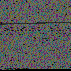

# pngCipher
A js library for hashing text to a format which can be displayed as a png

## Quickstart
~~~ javascript
// encode data
pngCipher.encode(text, function(hash) {
	console.log(hash);
	document.querySelector('#image').src = "data:image/png;base64,"+ hash;
});

// decode a hashed string
pngCipher.decode(hash, onError, onSuccess);

function onError(err) {
	alert("There's been an error!\n\n" + err);
}

function onSuccess(text) {
	console.log(text);
}
~~~

## Intro
This library can be used to encode any string to a format that can be displayed as a png. It can also be used to decode previously hashed png images.

This library does NOT depend on the browser's canvas functionality, and therefore WILL produce identical hashes accross different browsers [[1]](http://stackoverflow.com/questions/26615580/is-canvas-getimagedata-method-machine-browser-dependent)[[2]](http://stackoverflow.com/questions/36273990/canvas2d-todataurl-different-output-on-different-browser/36274211)

Below is the introduction of [Marijn Haverbeke's excellent book, "Eloquent JavaScript"](http://eloquentjavascript.net/00_intro.html) in png format:

Please note a few things:
1. For now, the input string must be limited to the set of characters defined by the 256 ASCII code table.
2. This is in NO WAY a secure hashing method. If you want to securely store something in a png, you'll need to first securely hash your string before calling the encoder.

## WHY?!
You might be asking yourself, "Why in the world would anyone want to use this?!" Well, one reason is that some mediums of communication don't allow users to attach zipfiles. A good example is MMS. However, MMS WILL allow users to send / receive images. Using this library, large amounts of data could be sent over MMS as images.

Also, I got bored on a Friday afternoon...

## Browserfy
If you want to use this in the browser, you can either use the minified file included in the dist folder, or you can build from source with browserfy:

`$ browserify index.js --standalone pngCipher > ../dist/pngCipher.js`